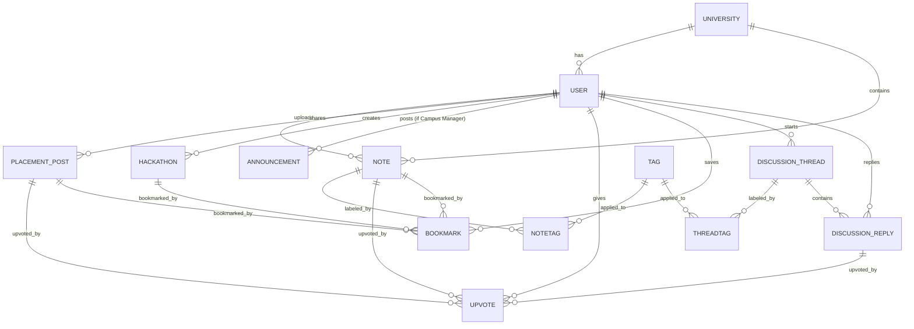

# 📐 Entity Relationship Diagram (ERD)

The following diagram visualizes the core relationships between entities in the **Kalvi Connect** database.

### 📋 Model Breakdown

- **Core Objects**: `User`, `University`, `Note`, `PlacementPost`, `Hackathon`, `Announcement`.
- **Identity & Relations**: `Auth`, `Role`.
- **Engagement Modules**: `Upvote`, `Bookmark`, `DiscussionThread`, `DiscussionReply`.
- **Categorization**: `Tag`, `NoteTag`, `ThreadTag`.

---

> [!NOTE]
> Junction tables (`NoteTag`, `ThreadTag`) are used to maintain 3NF for multi-tagging categorization without duplicating long strings.
